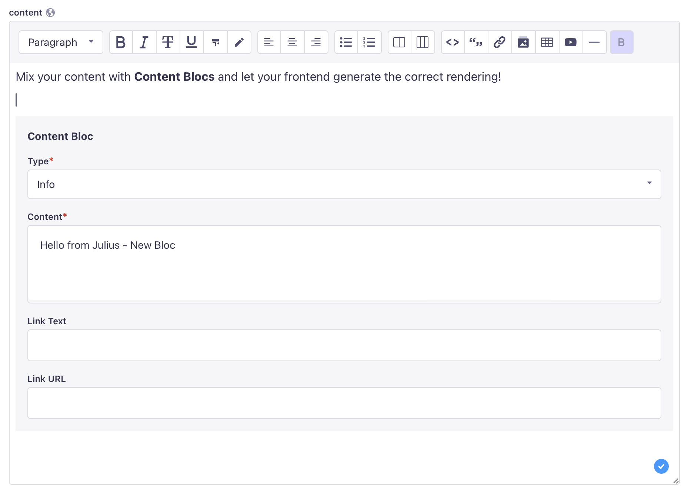
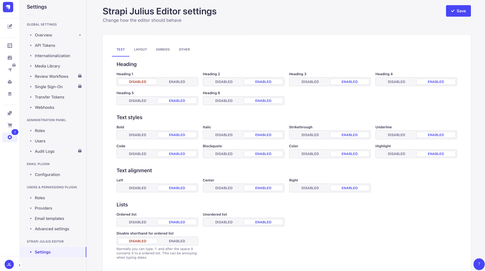
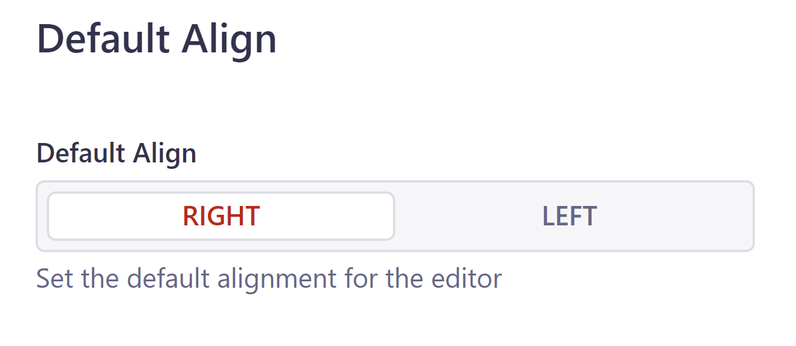

# Strapi TipTap Editor
A drop-in replacement for the strapi editor based on [TipTap](https://tiptap.dev/).
It support usual text formatting, tables, videa, images, ... and content blocks (still in dev).

It saves as plain HTML, making it easy to use with various frontends.

We also plan to add AI based content generation in the future.

 

This is a fork of the original [strapi-tiptap-editor](https://github.com/dasmikko/strapi-tiptap-editor)


## Requirements
It's build for Strapi **v4**. 

## What is a content block and how do I use it?
A content block is a structured content composed of different fields. It's a way to add more complex content in the content editor. It could be a "call to action" block, a "hero" block, or a "product" block.

It is based on the [Tiptap interactive node views](https://tiptap.dev/docs/editor/guide/node-views/react).

Until now, there is only one : CTA (Call to action). It's composed of a type, a title, a text and a link. We will see later how to add more content blocks.

The produced output HTML tag is : 
```code
<block-component 
type\"..." 
title="...." 
text="..."
link_text="..."
link_url="....">
</block-component>
```

In your front-end, eg. NextJS, you can use a lib like html-react-parser to render this kind of tag.
The type can be used to have different styles for different content blocks. The list of types can be configured in the Strapi settings for this extension.

## Install 

```
# Install the dependency
npm install tiptap-editor-strapi

or 

yarn add tiptap-editor-strapi
```

### Add the following to the webpack config (/src/admin/webpack.config.js)
This is due to tippy.js doesn't have an ES6 module, and a tiptap depencency imports it as such.

```javascript
config.plugins.push(new webpack.NormalModuleReplacementPlugin(
  /^tippy\.js$/,
  'tippy.js/dist/tippy-bundle.umd.min.js'
))
```
### Add the following to middlewares config (/config/middlewares.js)
You need to add "frame-src": ["'self'", "www.youtube.com"] to the content security policy to allow embedding YouTube videos in your Strapi editor.
```javascript
export default [
  // other policies
  {
    name: "strapi::security",
    config: {
      contentSecurityPolicy: {
        useDefaults: true,
        directives: {
          "connect-src": ["'self'", "http:", "https:"],
          "frame-src": ["'self'", "www.youtube.com"],
          upgradeInsecureRequests: null,
        },
      },
    },
  },
 // other policies
];

```

### Build the Strapi Admin
npm run build


# Setting up the editor
You should now be able to access to the editor settings in the Strapi admin. 



### RTL Support
To align content written in languages such as Arabic (العربية), Urdu (اُردُو), or Persian (فارسی) to the left, you'll need to set the default editor alignment to the right using the settings below.



